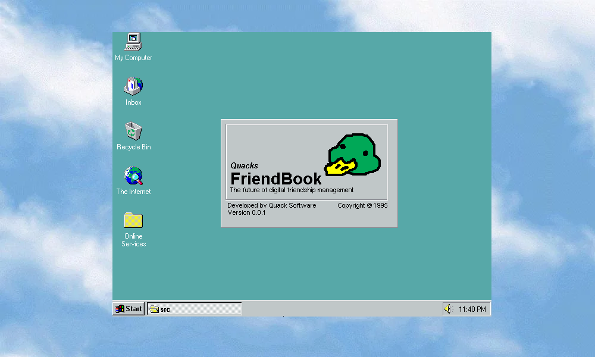

# Quacks Friend Book

A robust friend book application written in Delphi for managing your most valuable connections.

## About

Since time immemorial, we have been scattered. Our friends' phone numbers scrawled on napkins, their addresses lost to the void, their birthdays forgotten in the digital aether. We have relied on unreliable services, corporate platforms that monetize our relationships, and clunky interfaces that make maintaining friendships feel like a chore. But no more. The time has come for a different way.

For too long, we have been told that the cloud is the answer. That our most precious relationships should be stored in somebody else's database, indexed by somebody else's algorithms, monetized for somebody else's profit margins. We are told this is *progress*. We are told we should be grateful. We are assured that our data is safe, secure, and private Veven as our friends' information is harvested, analyzed, and sold to the highest bidder. We watch as social graphs are weaponized, as friendship networks become vectors for manipulation, as the very fabric of human connection is torn apart and rewoven into a tapestry of engagement metrics and conversion funnels.

The gatekeepers have long held dominion over our social lives. We have been made to depend on their services, to accept their terms of service, to surrender our autonomy in exchange for the illusion of convenience. We have been scorned for wanting something simpler, something that does not require us to genuflect before the altar of cloud computing. We have been told that local applications are dead, that the future belongs to the web, to the cloud, to the endless scroll of the algorithm.

But we refuse to accept this tyranny. We refuse to let our most important relationships become commodities. We refuse to participate in a system that treats friendship as a product to be optimized, tested, and sold.

Quack's Friend Book rises to meet this challenge. Written in the time-tested power of Delphi, this friend book app puts the management of your most important relationships back in *your hands*. Back in *your control*. No cloud. No corporate servers. No tracking. No algorithms deciding which friends matter most. No telemetry phoning home your secrets. Just you, your friends, a floppy disk, and a straightforward, reliable application that does what it's supposed to do and nothing more, nothing less.

This is not a web app. This is not a mobile service requiring constant internet connectivity and API keys. This is not another social network promising connection while delivering only data extraction. This is a real desktop application, designed to run on your computer, storing your data where it belongs: under your roof, subject to your will, protected by your choices.

Your friends' names, phone numbers, addresses, and all the little details that make them *your* friends, they deserve better than to be data points in someone's database. They deserve to be remembered on your terms, in your way, without interference or mediation from Silicon Valley overlords who have never met them and do not care about them.

The time has come for us to take back control of our social fabric, brothers and sisters. The time has come to reclaim what is ours. To remember our friends not because an algorithm reminded us, but because we choose to. To maintain our connections on our own terms. To prove that there is another way, a better way.

## Features

- **Simple Contact Management** - Add, edit, and organize your friends' information
- **Reliable Storage** - Your data stays on your machine
- **Fast & Responsive** - Built with Delphi for snappy performance
- **Easy to Use** - Intuitive interface for managing your connections

## Getting Started

This project is built with Delphi. Open `src/QFB.dpr` in your Delphi IDE to get started.

### Project Structure

Work in progress

## Requirements

- Delphi (compatible version)
- Windows 95 (for an authentic experience)

## Contributing

Found a friend worth remembering? Have ideas to improve how we track our most important people? Contributions are welcome!

## License

MIT, do with it what you want
